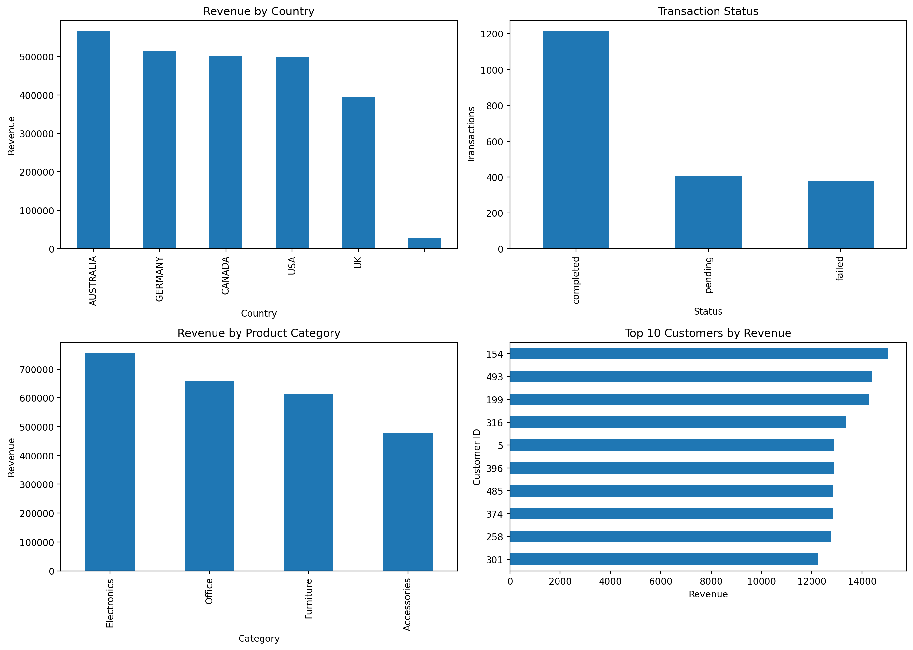
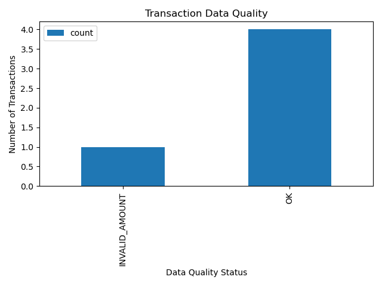

# Enterprise ETL & Analytics Pipeline

## Overview

Built an end-to-end ETL and analytics pipeline that extracts, transforms, validates, enriches, and loads synthetic enterprise data into a structured SQLite data warehouse, with automated data-quality checks, testing, KPI reporting, visualization, and execution logging.

The project demonstrates how raw operational data can be extracted, transformed, validated, enriched, loaded into a structured data warehouse, tested, and converted into business-oriented analytics.

The pipeline processes intentionally generated synthetic enterprise data containing:

* 500 customers
* 2,000 transactions
* 50 products
* 2,000 enriched transaction records

The source data intentionally contains data-quality issues so the pipeline can demonstrate automated detection, validation, reporting, and downstream analysis.

---

## Key Results

- Processed 500 customers, 2,000 transactions, and 50 products through the ETL pipeline.
- Generated 2,000 enriched transaction records for downstream analytics.
- Implemented 24 automated data-quality checks across customer, transaction, and product datasets.
- Detected 22 invalid transaction amounts and 2 invalid product prices.
- Built staging, dimension, and fact tables in a SQLite data warehouse.
- Automated pipeline validation with Pytest, with 4 tests passing.
- Generated KPI reporting including revenue, transaction volume, customer counts, and average transaction value.
- Produced analytical visualizations using Matplotlib.
- Implemented execution logging for pipeline monitoring and reproducibility.

---

## Architecture

```text
Synthetic Source Data
        |
        v
   Data Extraction
        |
        v
   Data Transformation
        |
        v
 Data Quality Validation
        |
        v
 SQLite Data Warehouse
        |
   +----+----+
   |         |
   v         v
 Testing   Analytics
             |
        +----+----+
        |         |
        v         v
       KPIs   Visualization
```

---

## Technology Stack

| Technology | Purpose                                       |
| ---------- | --------------------------------------------- |
| Python     | ETL pipeline development and automation       |
| Pandas     | Data transformation and analysis              |
| SQL        | Data querying and analytical calculations     |
| SQLite     | Relational source database and data warehouse |
| Pytest     | Automated pipeline testing                    |
| Matplotlib | Data visualization                            |
| Git/GitHub | Version control and project documentation     |

---

## Project Structure

```text
enterprise_etl_project/
|
├── data/
|   ├── customers.csv
|   ├── products.csv
|   └── transactions.csv
|
├── data_quality/
|   └── quality_checks.py
|
├── docs/
|   └── architecture.md
|
├── etl_pipeline/
|   ├── __init__.py
|   ├── extract.py
|   ├── transform.py
|   ├── load.py
|   └── run_pipeline.py
|
├── logs/
|   └── pipeline.log
|
├── output/
|   ├── data_quality_report.csv
|   ├── enterprise_analytics_dashboard.png
|   └── transaction_quality.png
|
├── scripts/
|   ├── data_visualization.py
|   ├── generate_data.py
|   ├── kpi_dashboard.py
|   └── run_quality_checks.py
|
├── sql/
|   └── analytics_queries.sql
|
├── tests/
|   └── test_pipeline.py
|
├── .gitignore
└── README.md
```

---

## ETL Pipeline

### Extract

The extraction layer reads customer, transaction, and product data from SQLite into Pandas DataFrames.

The pipeline separates extraction from transformation and loading, allowing each stage to be developed, executed, and tested independently.

### Transform

The transformation layer prepares source data for analytics and data warehousing.

Transformations include:

* Data validation
* Data cleaning
* Data-quality indicator creation
* Transaction enrichment
* Customer and product joins
* Preparation of analytics-ready datasets

Transaction records are enriched with related customer and product information to create a combined analytical dataset containing 2,000 enriched transaction records.

### Load

The loading layer writes processed datasets into a structured SQLite data warehouse.

The warehouse contains staging, dimension, and fact tables.

#### Staging Tables

* `stg_customers`
* `stg_transactions`
* `stg_products`

#### Dimension Tables

* `dim_customers`
* `dim_products`

#### Fact Tables

* `fact_transactions`
* `fact_transaction_customer`

This structure demonstrates fundamental data-warehouse concepts by separating staging data from analytical dimensions and transactional facts.

---

## Data Quality Framework

The project includes an automated data-quality framework designed to identify problematic records before they are used for downstream analysis.

The framework performs 24 individual validation checks across customer, transaction, and product data.

Automated checks include:

* NULL value detection
* Duplicate record detection
* Invalid transaction amount detection
* Invalid product price detection

The generated source data intentionally contains invalid records.

The final quality run identified:

* 22 transactions with invalid amounts
* 2 products with invalid prices
* All tested NULL checks passed
* All tested duplicate checks passed

The pipeline reports these issues rather than silently removing the records, allowing data-quality problems to be identified and investigated.

Quality results are exported to:

```text
output/data_quality_report.csv
```

---

## Automated Testing

The project uses Pytest to validate important parts of the pipeline.

The test suite verifies:

* Transformation output
* Transaction data
* Product data
* Expected non-empty pipeline results

The final automated test run:

```text
4 passed
```

Run the tests with:

```bash
python3 -m pytest
```

---

## SQL & Analytics

SQL is used throughout the project to query source and warehouse data and support analytical workflows.

The project supports analysis including:

* Customer counts
* Transaction counts
* Revenue calculations
* Average transaction value
* Data-quality analysis
* Product analysis
* Transaction-status analysis
* Aggregations and grouped analysis
* Relational joins

The warehouse structure provides organized staging, dimension, and fact tables for downstream analytical queries.

---

## KPI Reporting

The project includes a Python-based KPI reporting script that generates business-oriented metrics from the processed data.

The final pipeline produces:

* Total customers: **500**
* Total transactions: **2,000**
* Valid transactions: **1,978**
* Invalid transactions: **22**
* Total transaction amount: **$2,501,720.60**
* Average transaction value: **$1,264.77**
* Total products: **50**

Run the KPI report with:

```bash
python3 scripts/kpi_dashboard.py
```

---

## Data Visualization

The project uses Matplotlib to convert processed warehouse data into business-oriented analytical visualizations.

### Enterprise Analytics Dashboard

The dashboard summarizes key analytical results from the processed dataset, including transaction and business metrics.



### Transaction Quality

This visualization highlights transaction data-quality results, including valid and invalid transaction records.



---

## Logging

The ETL pipeline includes execution logging to provide basic operational visibility.

Pipeline events are recorded in:

```text
logs/pipeline.log
```

The log records major execution stages including:

* Pipeline start
* Data extraction
* Transformation completion
* Warehouse loading
* Pipeline completion

Logging provides visibility into pipeline execution and helps identify where failures occur.

---

## Data Warehouse

The SQLite warehouse stores processed datasets used for downstream analytics.

The final warehouse contains:

* 500 customer records
* 2,000 transaction records
* 50 product records
* 2,000 enriched transaction records

The warehouse design separates operational staging data from analytical dimensions and facts, providing a structured foundation for reporting and analysis.

---

## Reproducibility

The project includes a synthetic data-generation script so the pipeline can be rerun using a controlled dataset.

### Generate Source Data

```bash
python3 scripts/generate_data.py
```

### Run the ETL Pipeline

```bash
python3 -m etl_pipeline.run_pipeline
```

### Run Data-Quality Checks

```bash
python3 -m scripts.run_quality_checks
```

### Run Automated Tests

```bash
python3 -m pytest
```

### Generate KPI Report

```bash
python3 scripts/kpi_dashboard.py
```

### Generate Visualizations

```bash
python3 scripts/data_visualization.py
```

---

## Key Skills Demonstrated

### Data Engineering

* ETL pipeline development
* Data extraction
* Data transformation
* Data enrichment
* Data validation
* Data warehousing
* Staging tables
* Dimension tables
* Fact tables
* Pipeline automation

### Python

* Python programming
* Pandas
* DataFrame operations
* Modular Python development
* Functions
* Database interaction
* Pipeline scripting

### SQL & Databases

* SQL querying
* SQLite
* Relational data modeling
* Filtering
* Aggregations
* Grouping
* Joins
* Data warehouse table design

### Data Quality

* NULL validation
* Duplicate detection
* Business-rule validation
* Invalid-record detection
* Automated quality reporting

### Analytics

* KPI development
* Revenue analysis
* Customer analysis
* Product analysis
* Transaction analysis
* Data visualization

### Software Engineering Practices

* Automated testing with Pytest
* Pipeline logging
* Modular project structure
* Reproducible execution
* Git/GitHub version control
* Separation of pipeline stages

---

## Project Outcome

This project demonstrates an end-to-end data engineering and analytics workflow, from synthetic source-data generation and extraction through transformation, validation, enrichment, warehouse loading, automated testing, KPI reporting, and visualization.

The result is a reproducible enterprise-style pipeline that transforms raw operational data into validated, structured, and analytics-ready data.

The project provides practical experience across:

* Data engineering
* Python development
* SQL
* Data quality
* Data warehousing
* Automated testing
* Business analytics
* Data visualization
* Software engineering practices

**Project scale:** 500 customers, 2,000 transactions, 50 products, and 2,000 enriched transaction records.

**Final test status:** 4 automated tests passing.
